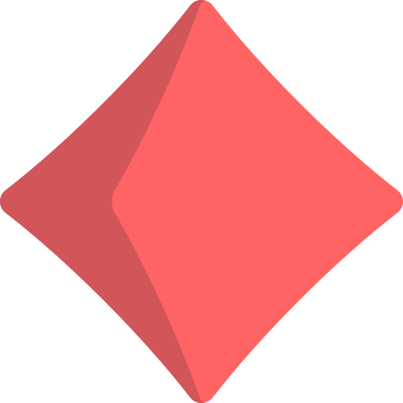
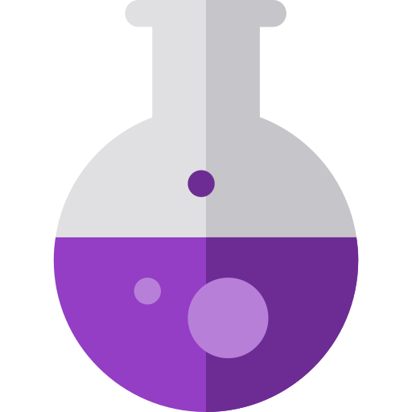

## **Claudion**

Claudion is a web-based game heavily inspired by Sigmar's Garden, a minigame from the very fun [Opus Magnum](http://www.zachtronics.com/opus-magnum/) by Zachtronics.

The objective is to clear all stones off the board. 

There are essentially three types of stone:

 Coloured stones like these can only be matched against their corresponding colour. The exception is the grey stone which functions as a wildcard and can match on all other colours, including other wildcards.

 Wealth stones need to be removed in the order with which they can be transmuted via potions. When all lesser metals are removed, the gold can be removed just by clicking on it. 

The order they need to be removed is as follows:

 Tin

 Iron

 Garnet

 Jade

 Aquamarine

 Life stones can be removed in pairs by matching each opposing stone.

Built and compiled with [shadow-cljs](https://shadow-cljs.org/).